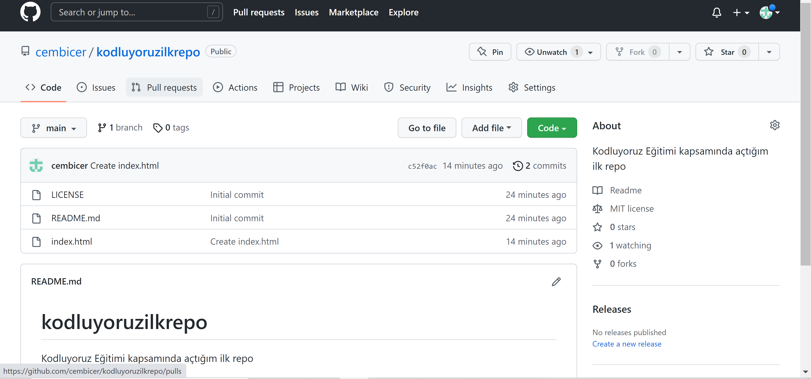

# kodluyoruzilkrepo
Bu repo [kodluyoruz](https://www.kodluyoruz.org/) front end eğitiminde oluşturduğumuz ilk repo. İçerisinde bir adet README dosyası, bir adet de index.htmlbarındırıyor.

## Installation
Öncelikle projeyi klonlayın.
`https://github.com/cembicer/kodluyoruzilkrepo.git`
## Usage
Projeyi cloneladıktan sonra Visual Studio Code programında açınız.
Linux için:
```
cd kodluyoruzilkrepo
code .
```
## Contributing
Pull requestler kabul edilir. Büyük değişiklikler için, lütfen önce neyi değiştirmek istediğinizi tartışmak için bir konu açınız.
## License
[MIT](https://choosealicense.com/licenses/mit/)
